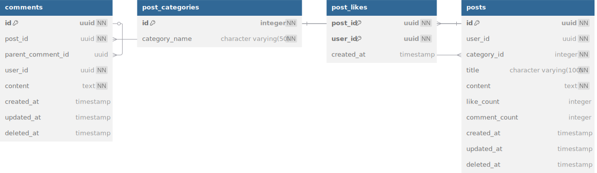

# 공익생활(gongik life) 클라이언트 백엔드 프로젝트 소개

- 공익생활은 사회복무요원을 위한 커뮤니티 플랫폼입니다.

- 공익생활은 사회복무요원(공익)들이 서로 소통하고 복무지 정보를 공유할 수 있는 공간을 제공합니다.
- 공익인간이라는 어플리케이션의 일부 기능들을 구현해본 프로젝트입니다.
- 이 프로젝트는 공익생활의 클라이언트 백엔드 부분을 담당하며 Spring Boot MSA 아키텍처로 구성되어 있습니다.
- 인증 서버만 Rest API로 구현되어 있으며 나머지 서비스들은 GraphQL로 구현되어 있습니다. 밑에서 왜 이렇게 했는지 궁금증 있을만 한것들 한번에 설명하겠습니다.
- Msa간 동기 통신 Grpc로, 비동기 통신은 Kafka로 구현되어 있습니다. (일부 인증 제외)
- 2025년 2월 28일부터 어드민 백엔드를 nestjs (monolithic) 로 구현 중에 있습니다.

## Swagger, Graphiql 📝

api 보시라고 배포해둔 상태이나 msa프로젝트라 aws or gcp에 배포하기엔 금액적인 부담이 있어 홈서버에 배포해두었습니다.
홈서버라 불안정한 면이 있어 우선 서버 상태를 확인하시고 swagger, graphiql로 api를 확인하시기 바랍니다.

- [Eureka Discovery](https://clientbediscovery.gongik.shop)
- [Swagger Rest Api(Only Auth service)](https://clientbe.gongik.shop/swagger-ui/index.html)
- [Graphiql Api](https://clientbe.gongik.shop/graphiql)

## 제작 기간 📅 && 참여 인원 🧑‍🤝‍🧑

- 2024.12.26 ~ 2025.02.27
- 산업기능요원 취업을 위한 개인 프로젝트입니다.

## 주요 기능 ✨

#### 밑에 api별로 상세 설명이 있으니 여기선 큰 틀에서 설명하겠습니다.

1. 회원가입후 사회복무요원 복무지 검색, 복무지에 대한 정보와 후기(별점 필수)공유
2. 커뮤니티를 통해 카테고리별로 소통, 대댓글은 1차 대댓글까지만 가능
3. 본인의 평균 근무시간과 복무지 유형 별로(사회복지, 공공 등등)의 평균 근무시간 비교 (리뷰 필수, 일주일마다 리뷰 데이터 활용해 배치로 평균 계산)
4. 본인글에 댓글, 혹은 대댓글 알림 (Graphql subscription)
5. 신고 기능 (시스템신고, 기관 신고, 글신고 등등 다양, 어드민 be랑 연동도 가능)

## 시스템 구성도 🗺️

## 기술 스택 🧑‍💻

#### Back-End

- Java 17
- Spring Boot 3.2.5
- Spring Cloud
- Spring Graphql
- Spring Security (jwt)
- Spring Batch
- Spring Data JPA
- Spring Data Redis
- Eureka Discovery
- Eureka Client
- Grpc
- Websocket

#### Data Storage & Processing

- PostgreSQL
- Redis
- Kafka

#### Distributed Tracing

- Zipkin
- ElasticSearch
- Logstash
- Kibana

#### Monitoring

- Prometheus
- Grafana

### Deployment

- Cloudflare
- Home server using proxmox
- Docker compose

## ERD 🗺️

#### (msa 프로젝트라 서비스마다 db가 나뉘어져 있습니다.)

- 유저 DB
  

- 복무 기관 DB
  

- 커뮤니티 DB
  

- 근무시간 DB

  

- 알림 DB
  

- 신고 DB
  

## API 목록 📃

#### (Auth service 외에는 전부다 graphql api입니다, 개발한 순서대로 입니다, git feature 브랜치 순서와 동일)

1. [Institution Service] searchInstitutions: 복무지 검색 기능, graphql service ->
   institution service -> searchInstitution (회원가입시와 복무지 검색 등등에 사용됨, 무한 스크롤 대비한 커서 페이징 적용)

2. [User Service] sendEmailVerificationCode: 회원가입시 이메일 인증 코드 발송, graphql service -> user
   service -> kafka -> mailservice (인증코드 시간 제한이 있어 redis 활용(ttl), 메일 전송은 비동기 요청 kafka 활용)

3. [User Service] verifyEmailCode: 회원가입시 이메일 인증 코드 검증, graphql service -> user service (인증 완료후에도 해당 메일로 가입가능한 시간 제한이
   있어 redis 활용(ttl))

4. [User Service] signUp: 회원가입, graphql service -> user service -> kafka -> institution service (복무지 등록)
   service -> kafka -> user service (회원가입 후 자동 로그인 처리되는데 이때 로그인 기록 남기기 위해 비동기로 로그인 기록 남기는 요청, kafka 활용, 로그인시 accees
   token은 body에 주고 refresh token은 쿠키에 담아줌, refresh token은 user id와 매칭해 redis에 저장후 sign out, refresh accesstoken 시에도
   활용됨, 복무중인 사람이면 복무기관 및 소집일자도 등록할수 있)

5. [Auth service] signIn: 로그인, auth service -> kafka -> user service (로그인 기록 남기기 위해 비동기로 로그인 기록 남기는 요청, kafka 활용,
   로그인시
   accees
   token은 body에 주고 refresh token은 쿠키에 담아줌, refresh token은 user id와 매칭해 redis에 저장후 sign out, refresh accesstoken 시에도
   활용됨)

6. [Auth service] validateAccessToken: access token 검증, auth service

7. [Auth service] refreshAccessToken: refresh token으로 access token 재발급, auth service (redis에 저장된 refresh token과 비교검증)

8. [Auth service] signOut: 로그아웃, auth service (redis에 저장된 refresh token 삭제)

9. [User service] myProfile: 내 프로필 조회, graph service -> user service -> institution service (내 프로필 조회시 1일 캐싱)

10. [User service] userProfile: 타인 프로필 조회, graph service -> user service -> institution service (타인 프로필 조회시 1일 캐싱)

11. [User service] updateProfile: 내 프로필 수정, graph service -> user service -> institution service (내 프로필 수정시 cache put
    업데이트)

12. [Institution service] institution: 복무지 정보 조회, graph service -> institution service (복무지 정보 조회시 5일 캐싱, 단 리뷰 갯수는
    캐싱안하고 분리해서 직접 가져옴)

13. [Institution service] createInstitutionReview: 복무지 리뷰 등록, graph service -> institution service -> user service (
    복무지 리뷰 등록할려면 본인 프로필에 복무지 정보 등록부터 해야함)

14. [Institution service] deleteInstitutionReview: 복무지 리뷰 삭제, graph service -> institution service (복무지 리뷰 삭제시 Cache
    evict)

15. [Institution service] likeInstitutionReview: 복무지 리뷰 좋아요, graphql service -> kafka -> institution service (좋아요는 비동기
    kafka로 처리함, fe에선 optimistic ui로 처리)

16. [Institution service] unlikeInstitutionReview: 복무지 리뷰 좋아요 취소, graphql service -> kafka -> institution service (좋아요
    취소는 비동기 kafka로 처리함, fe에선 optimistic ui로 처리)

17. [Institution service] institutionReview: 복무지 리뷰 조회, graph service -> institution service -> user service (복무지 리뷰
    조회시 5분 캐싱,
    isLiked여부 때문에 로그인한 유저일 시 isLiked는 직접 가져옴)

18. [Institution service] institutionReviews: 복무지 리뷰 목록 조회, graph service -> institution service -> user service (커서
    페이징, 카테고리도 적용, isLiked여부도 로그인 한 유저일시 가져옴)

19. [Institution service] myInstitutionReviews: 내 복무지 리뷰 목록 조회, graph service -> institution service (페이징 적용 X, 사회복무요원
    특성상 거의 복무지 옮기는 경우가 없음)

20. [Institution service] institutionReviewsByInstitution: 복무지별 리뷰 목록 조회, graph service -> institution service -> user
    service
    (커서 페이징 적용)

21. [Community service] createPost: 커뮤니티 글 등록, graph service -> community service (카테고리별로 글 등록)

22. [Community service] updatePost: 커뮤니티 글 수정, graph service -> community service (글 수정시 Cache put 발생)

23. [Community service] deletePost: 커뮤니티 글 삭제, graph service -> community service -> kafka -> community service (글 삭제시
    Cache evict 발생, 글과 관련된 댓글 전체 소프트 삭제는 비동기 kafka로 요청)

24. [Community service] likePost: 커뮤니티 글 좋아요, graphql service -> kafka -> community service (좋아요는 비동기 처리)

25. [Community service] unlikePost: 커뮤니티 글 좋아요 취소, graphql service -> kafka -> community service (좋아요 취소는 비동기 처리)

26. [Community service] post: 커뮤니티 글 조회, graphql service -> community service -> user service (글 조회시 5분 캐싱, 단 댓글 갯수는
    직접 가져옴, isLiked 여부는 로그인한 유저일 시 직접 가져옴)

27. [Community service] posts: 커뮤니티 글 목록 조회, graphql service -> community service -> user service (커서 페이징 적용, 카테고리별로
    조회 가능, 댓글 갯수는 직접 가져옴, isLiked 여부는 로그인한 유저일 시 직접 가져옴)

28. [Community service] createComment: 커뮤니티 댓글 등록, graphql service -> community service -> kafka -> notification
    service -> kafka -> graphql subscription (댓글 등록시 대댓글 깊이는 1단까지만 가능, 댓글 등록시 로그인해 있는 유저일시 알림을 graphql subscription으로
    보내주기 위해 비동기 처리함 )

29. [Community service] updateComment: 커뮤니티 댓글 수정, graphql service -> community service

30. [Community service] deleteComment: 커뮤니티 댓글 삭제, graphql service -> community service

31. [Community service] comments: 커뮤니티 댓글 목록 조회, graphql service -> community service -> user service (자식 댓글들 가져오기 위해
    recursive 쿼리 활용)

32. [Community service] myPosts: 내 커뮤니티 글 목록 조회, graphql service -> community service (커서 페이징 적용,
    isLiked여부는 로그인한 유저일 시 직접 가져옴)

33. [Community service] userPosts: 유저 커뮤니티 글 목록 조회, graphql service -> community service -> user service (커서 페이징 적용,
    isLiked여부는 로그인한 유저일 시 직접 가져옴)

34. [Community service] myLikedPosts: 내가 좋아요한 커뮤니티 글 목록 조회, graphql service -> community service -> user service (커서
    페이징 적용,
    isLiked여부는 로그인한 유저일 시 직접 가져옴)

35. [Community service] myComments: 내 커뮤니티 댓글 목록 조회, graphql service -> community service -> user service (커서 페이징 적용)

36. [Community Service] searchPosts: 커뮤니티 글 검색, graphql service -> community service -> user service (커서 페이징 적용, 카테고리도
    적용, isLiked여부는 로그인한 유저일 시 직접 가져옴)

37. [Report service] createSystemReport: 시스템 신고 , graphql -> report service (시스템 신고 유형 존재)

38. [Report service] createReport: 기관, 기관리뷰, 글, 댓글 신고 , graphql -> report service -> community, institution service (
    신고 유형 존재)

39. [Report service] deleteReport: 신고 삭제 , graphql -> report service (신고 상태 pending에서만 삭제 가능)

40. [Report service] report: 내 신고글 조회, graphql -> report service

41. [Report service] myReports: 내 신고글 목록 조회, graphql -> report service (커서 페이징 적용)

42. [Workhours service] averageWorkhours: 나의 평균 근시간과 다른 사람들의 복무 분야별 평균 근무시간 조회, graphql service -> workhours service (
    일주일마다 배치로 근무지 리뷰로부터 평균 근무시간 계산, 7일주일간 캐싱, 나의 평균 근무시간만 내가 작성한 복무지 리뷰로부터 가져옴)

43. [Notification service] myNotifications: 내 알림 목록 조회, graphql service -> notification service (커서 페이징 적용, 알림 타입이 여러개
    존재)

44. [Notification service] markNotificationAsRead: 알림 읽음 처리, graphql service -> kafka ->notification service (비동기 처리)

45. [Notification service] markAllNotificationsAsRead: 모든 알림 읽음 처리, graphql service -> kafka -> notification
    service (비동기 처리)

46. [Notification service] deleteNotification: 알림 삭제, graphql service -> kafka -> notification
    service (비동기 처리)

47. [Notification service] deleteAllNotifications: 모든 알림 삭제, graphql service -> kafka -> notification
    service (비동기 처리)

48. [Notification service] notificationRealTime: 알림 상세 조회, graphql service -> notification service (graphql
    subscription으로
    실시간 알림 가능)

## 프로젝트 간단 추가 설명 😄

- 인증서버만 rest api로 구현한 이유는 헤더에 accesstoken이 포함되어있을 경우 gateway authenticationFilter에서 http post요청으로 validateAccessToken을
  해서 userId를 헤더에 담아 graphql service로 넘겨주기 위함입니다. 인증서버에서 하나만 rest api로 구현해도 되지만, 그냥 전부다 rest api로 구현했습니다.
- 개인 개발이긴 하지만 gitflow 전략을 사용했습니다.
- 최대한 동기처리는 grpc로, 비동기 처리는 kafka로 구현했습니다.
- Rate limit은 gateway에서 구현했습니다.
- common 모듈을 만들어 msa에서 중복으로 사용되는 부분은 최대한 한군데서 관리하도록 했습니다.
- 테스트코드는 각 서비스별로 단위테스트만 작성했습니다.

## 프로젝트 회고 🤔

- 앞서 백엔드는 nestjs만 공부해봤고, spring boot는 공부후 처음 만들어보는 프로젝트인데 확실히 spring boot를 왜 많이 쓰는지 알겠습니다. 대부분 필요한게 이미 존재하고 설정도 매우
  편했습니다.
- Nestjs Di, Decorator, lifecycle (명칭이 다르긴 하지만)등등 보면 Spring boot를 많이 참고한것 같은데 nestjs는 자유도가 높은 대신 본인이 구현해야 하는게 많은것 같습니다.
- 개인 프로젝트라서 그런지 git commit을 자주 안한것 같습니다. git commit을 자주 하는 습관을 들여야겠습니다. 리팩토링 브랜치의 경우는 거의 마이크로 서비스 단위로 commit을 했습니다 😭

## 개선해야 할 사항 😄

- 현재 msa간에 어떠한 보안 처리도 하고 있지 않습니다.
- Db 쿼리시에 생쿼리를 날리고 있어 N+1 등등 여러가지 문제가 발생합니다.
- Graphql resolver 미사용 및 graphql schema에서 domain단위로 안내려주고 개별 dto로 내려줘서 fe에서 캐싱 중복이 발생합니다.
- Msa간 트랜잭션 처리가 필요합니다.
- 에러 코드 처리가 되어있지 않습니다. 에러를 그대로 내려주고 있습니다.

## 앞으로의 계획 😎

- 어드민 백엔드를 Nestjs로 Monolithic하게 구현중입니다. (알림, 신고 등등 몇가지를 이 프로젝트와 연동 해볼 예정입니다.)
- 개선 해야할 사항들을 다 반영하고 axonframework를 사용해 DDD+Hexagonal arhcitecture, Eda, Saga, Cqrs 적용해 다시 처음부터 코드 작성해볼 생각입니다.
- 쿼리 쪽은 Querydsl 도입, 검색 쪽은 Elasticsearch 도입, 배포 쪽은 Kubernetes 도입해볼 생각입니다. 홈서버 메모리가 증설되어 Kafka, redis, db등 레플리카 구성해볼
  생각입니다.
- 현재는 분산 로깅만 하고 있어 Apm Pinpoint를 도입해 성능 분석을 해볼 생각입니다.
 
