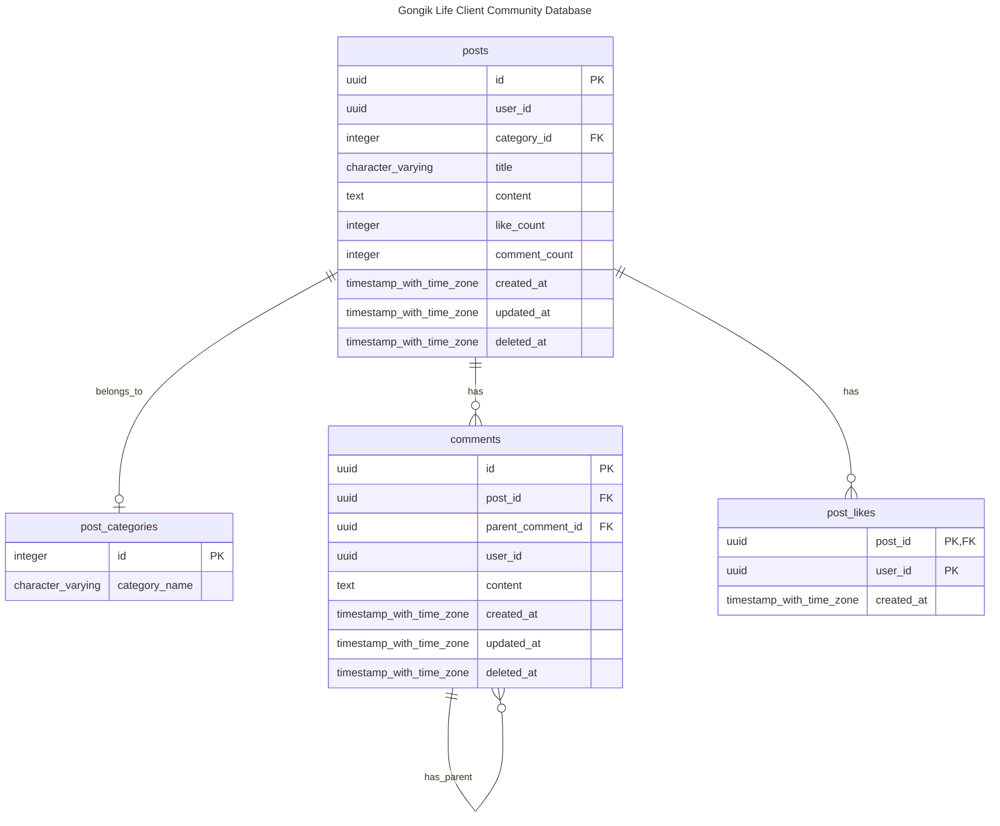

```mermaid
---
title: Gongik Life Client Community Database 
---
erDiagram
    post_categories {
        integer id PK
        character_varying category_name
    }
    posts {
        uuid id PK
        uuid user_id
        integer category_id FK
        character_varying title
        text content
        integer like_count
        integer comment_count
        timestamp_with_time_zone created_at
        timestamp_with_time_zone updated_at
        timestamp_with_time_zone deleted_at
    }
    comments {
        uuid id PK
        uuid post_id FK
        uuid parent_comment_id FK
        uuid user_id
        text content
        timestamp_with_time_zone created_at
        timestamp_with_time_zone updated_at
        timestamp_with_time_zone deleted_at
    }
    post_likes {
        uuid post_id PK, FK
        uuid user_id PK
        timestamp_with_time_zone created_at
    }

    posts ||--o| post_categories: belongs_to
    posts ||--o{ comments: has
    comments ||--o{ comments: has_parent
    posts ||--o{ post_likes: has
```