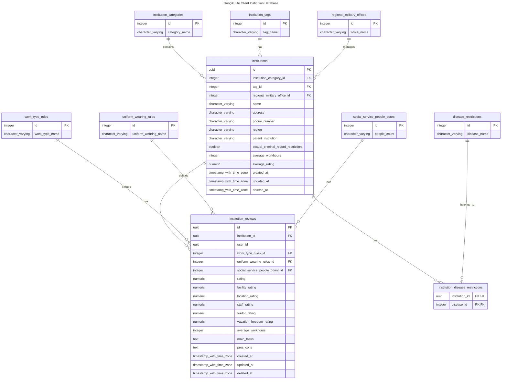

```mermaid
---
title: Gongik Life Client Institution Database 
---
erDiagram
    institution_categories {
        integer id PK
        character_varying category_name
    }
    institution_tags {
        integer id PK
        character_varying tag_name
    }
    disease_restrictions {
        integer id PK
        character_varying disease_name
    }
    regional_military_offices {
        integer id PK
        character_varying office_name
    }
    work_type_rules {
        integer id PK
        character_varying work_type_name
    }
    uniform_wearing_rules {
        integer id PK
        character_varying uniform_wearing_name
    }
    social_service_people_count {
        integer id PK
        character_varying people_count
    }
    institutions {
        uuid id PK
        integer institution_category_id FK
        integer tag_id FK
        integer regional_military_office_id FK
        character_varying name
        character_varying address
        character_varying phone_number
        character_varying region
        character_varying parent_institution
        boolean sexual_criminal_record_restriction
        integer average_workhours
        numeric average_rating
        timestamp_with_time_zone created_at
        timestamp_with_time_zone updated_at
        timestamp_with_time_zone deleted_at
    }
    institution_disease_restrictions {
        uuid institution_id PK, FK
        integer disease_id PK, FK
    }
    institution_reviews {
        uuid id PK
        uuid institution_id FK
        uuid user_id
        integer work_type_rules_id FK
        integer uniform_wearing_rules_id FK
        integer social_service_people_count_id FK
        numeric rating
        numeric facility_rating
        numeric location_rating
        numeric staff_rating
        numeric visitor_rating
        numeric vacation_freedom_rating
        integer average_workhours
        text main_tasks
        text pros_cons
        timestamp_with_time_zone created_at
        timestamp_with_time_zone updated_at
        timestamp_with_time_zone deleted_at
    }

    institutions ||--o{ institution_reviews: has
    institutions ||--o{ institution_disease_restrictions: has
    disease_restrictions ||--o{ institution_disease_restrictions: belongs_to
    institution_categories ||--o{ institutions: contains
    institution_tags ||--o{ institutions: has
    regional_military_offices ||--o{ institutions: manages
    work_type_rules ||--o{ institution_reviews: defines
    uniform_wearing_rules ||--o{ institution_reviews: defines
    social_service_people_count ||--o{ institution_reviews: has
```
