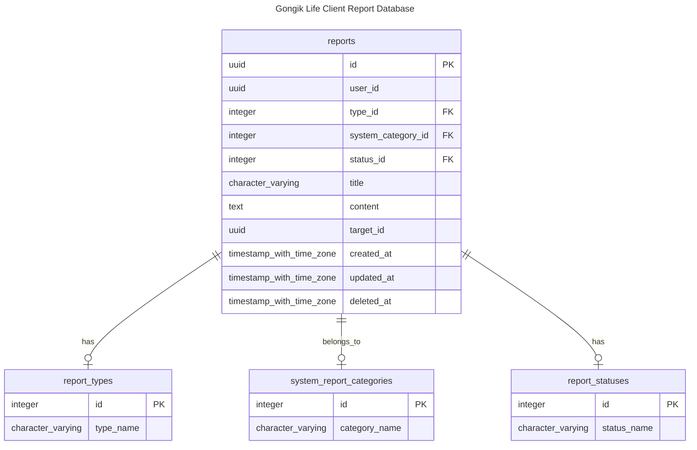

```mermaid
---
title: Gongik Life Client Report Database
---
erDiagram
    system_report_categories {
        integer id PK
        character_varying category_name
    }
    report_types {
        integer id PK
        character_varying type_name
    }
    report_statuses {
        integer id PK
        character_varying status_name
    }
    reports {
        uuid id PK
        uuid user_id
        integer type_id FK
        integer system_category_id FK
        integer status_id FK
        character_varying title
        text content
        uuid target_id
        timestamp_with_time_zone created_at
        timestamp_with_time_zone updated_at
        timestamp_with_time_zone deleted_at
    }

    reports ||--o| report_types: has
    reports ||--o| system_report_categories: belongs_to
    reports ||--o| report_statuses: has
```