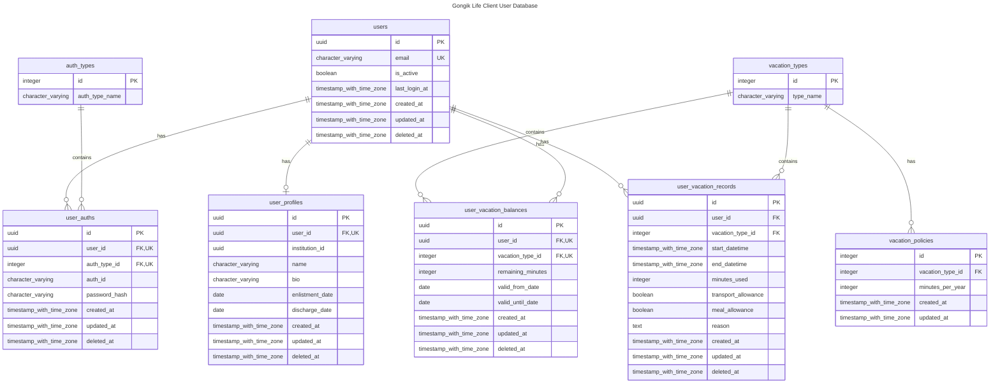

```mermaid
---
title: Gongik Life Client User Database 
---
erDiagram
    users {
        uuid id PK
        character_varying email UK
        boolean is_active
        timestamp_with_time_zone last_login_at
        timestamp_with_time_zone created_at
        timestamp_with_time_zone updated_at
        timestamp_with_time_zone deleted_at
    }
    auth_types {
        integer id PK
        character_varying auth_type_name
    }
    user_auths {
        uuid id PK
        uuid user_id FK, UK
        integer auth_type_id FK, UK
        character_varying auth_id
        character_varying password_hash
        timestamp_with_time_zone created_at
        timestamp_with_time_zone updated_at
        timestamp_with_time_zone deleted_at
    }
    user_profiles {
        uuid id PK
        uuid user_id FK, UK
        uuid institution_id
        character_varying name
        character_varying bio
        date enlistment_date
        date discharge_date
        timestamp_with_time_zone created_at
        timestamp_with_time_zone updated_at
        timestamp_with_time_zone deleted_at
    }
    vacation_types {
        integer id PK
        character_varying type_name
    }
    vacation_policies {
        integer id PK
        integer vacation_type_id FK
        integer minutes_per_year
        timestamp_with_time_zone created_at
        timestamp_with_time_zone updated_at
    }
    user_vacation_balances {
        uuid id PK
        uuid user_id FK, UK
        integer vacation_type_id FK, UK
        integer remaining_minutes
        date valid_from_date
        date valid_until_date
        timestamp_with_time_zone created_at
        timestamp_with_time_zone updated_at
        timestamp_with_time_zone deleted_at
    }
    user_vacation_records {
        uuid id PK
        uuid user_id FK
        integer vacation_type_id FK
        timestamp_with_time_zone start_datetime
        timestamp_with_time_zone end_datetime
        integer minutes_used
        boolean transport_allowance
        boolean meal_allowance
        text reason
        timestamp_with_time_zone created_at
        timestamp_with_time_zone updated_at
        timestamp_with_time_zone deleted_at
    }

    users ||--o{ user_auths: has
    users ||--o| user_profiles: has
    auth_types ||--o{ user_auths: contains
    vacation_types ||--o{ vacation_policies: has
    vacation_types ||--o{ user_vacation_balances: contains
    users ||--o{ user_vacation_balances: has
    users ||--o{ user_vacation_records: has
    vacation_types ||--o{ user_vacation_records: contains
```